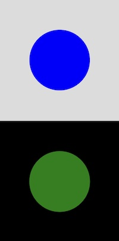

# [audio-reactive-simple](audio-reactive-simple)

Try the [live demo](https://editor.p5js.org/mngyuan/sketches/Q75alNf_G).

# [audio-reactive-text-paging](audio-reactive-text-paging)

Try the [live demo](https://editor.p5js.org/mngyuan/sketches/6bLYkyJTZ)

# [collision-blobs](collision-blobs)

# [collision-circle](collision-circle)

Try the [live demo](https://editor.p5js.org/mngyuan/sketches/2IdBcrGFm)

# [fullscreen](fullscreen)

Try the [live demo](https://editor.p5js.org/mngyuan/sketches/PuJcZonyN)

# [multiple-sketches](multiple-sketches)

# [nodejs-arduino](nodejs-arduino)

# [openai-api](openai-api)

# [osc-websocket](osc-websocket)

# [sensors-compass](sensors-compass)

# [shaders-bloom](shaders-bloom)

# [shaders-hello-world-image](shaders-hello-world-image)

Try the [live demo](https://editor.p5js.org/mngyuan/sketches/a3PbXLiyB)

# [shaders-threshold](shaders-threshold)

# [video-lookup-squares](video-lookup-squares)

# [video-seeking](video-seeking)

Try the [live demo](https://xrrca.github.io/CreativeCoding/js/video-seeking/)
