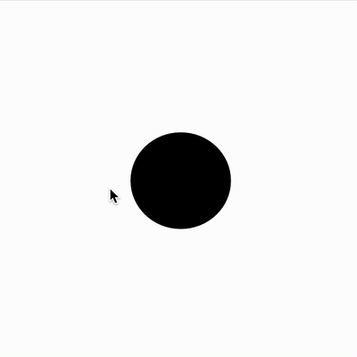

# Collision Detection within a circle

Detects when the mouse enters a circle by checking if the mouse is within a certain radius.

[Try it live](https://editor.p5js.org/mngyuan/sketches/2IdBcrGFm).
