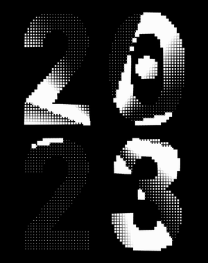

# Video lookup squares effect

Samples a base image's luma to draw a low resolution version,
then scales the pixels of the low resolution version by
sampling a lookup video's luma.

If you look at this code, it seems better written as a shader,
or in TouchDesigner, because the bulk of it is normalizing
coordinates and values. Left as a future exercise.

Based on the effect from [@andreiongd](https://www.behance.net/gallery/162774625/2022). [Try it live](https://editor.p5js.org/mngyuan/sketches/2yfqdcgv4).
