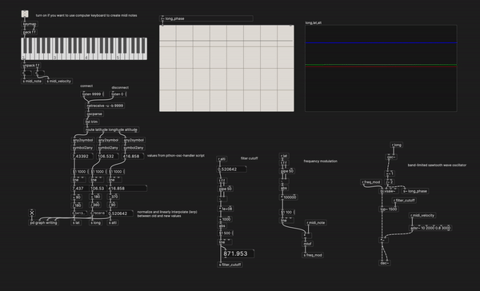

For pretty much all these example files, you will need these libraries:
  + [ELSE library](https://github.com/porres/pd-else)  
  + [Cyclone](https://github.com/porres/pd-cyclone)
  + [HeavyLib](https://github.com/Wasted-Audio/heavylib)
or just install [PlugData](https://plugdata.org/).

# [Data_sonification](data_sonification)

