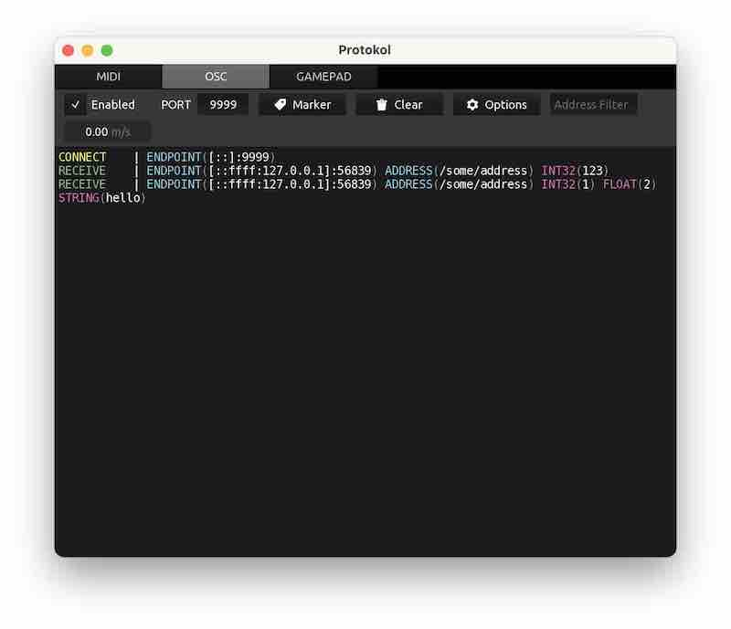

# Open Sound Control in Python



Basic OSC message sending in python - useful for relaying sensor data, pose detection data etc. to other programs. This example will send a few messages on the local machine at port 9999.

## Setup

First, in a terminal, navigate to the folder this example is in, then create a virtual environment in the folder `venv`

```
python -m venv venv
```

Activate the virtual environment - packages will install into your `venv` instead of globally, so you can try different examples that require different versions of packages without clashes

```
source venv/bin/activate
```

Install required packages as listed in `requirements.txt`

```
pip install -r requirements.txt
```

Run the example

```
python osc-simple.py
```

When you're done, you can exit the virtual environment by running

```
deactivate
```

[Download this example](https://github.com/XRRCA/CreativeCoding/raw/main/py/osc-simple/osc-simple.zip) | [Download all examples as `.zip`](https://github.com/XRRCA/CreativeCoding/archive/refs/heads/main.zip)

Adapted from https://python-osc.readthedocs.io/en/latest/client.html#example
