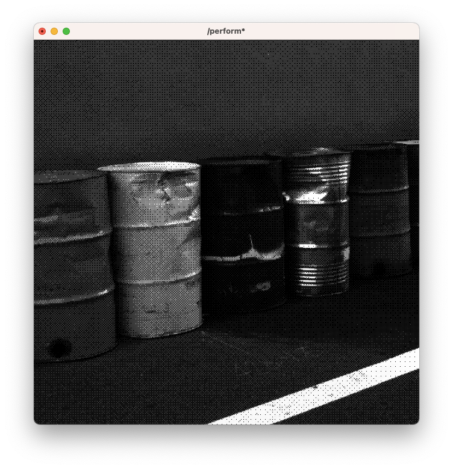

# [arduino-serial](arduino-serial)

# [audio-reactive-histogram](audio-reactive-histogram)

# [color-lookup-custom](color-lookup-custom)

# [data-smoothing](data-smoothing)

# [feedback-bloom](feedback-bloom)

# [feedback-tunnel](feedback-tunnel)

# [feedback-pixel-sorting](feedback-pixel-sorting)

# [harmonic-circles](harmonic-circles)

# [noise-loop-with-rgbadelay](noise-loop-with-rgbadelay)

# [opencv-background-removal](opencv-background-removal)

# [opencv-blob-tracking](opencv-blob-tracking)

# [particle-displacement](particle-displacement)

# [shaders-shadertoy-dither](shaders-shadertoy-dither)

# [video-projection-synced](video-projection-synced)

# [video-switcher](video-switcher)

