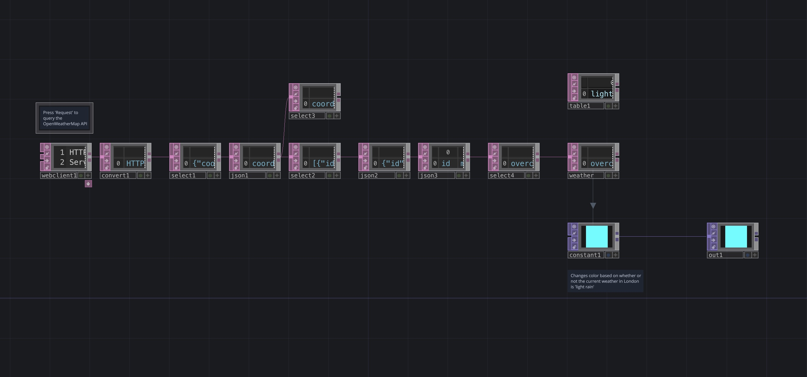

# Weather API

An example of how to use the OpenWeather free API to query the weather over the internet through an API request

[Download this example](https://github.com/XRRCA/CreativeCoding/raw/main/touchdesigner/api-weather/api-weather.toe) | [Download all examples as `.zip`](https://github.com/XRRCA/CreativeCoding/archive/refs/heads/main.zip)
