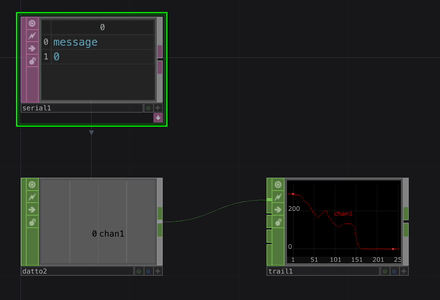

# Arduino Serial to TouchDesigner

Uses a serial DAT to bring data over Serial into TouchDesigner. The data is used to control the speed of a video file for demonstration purposes.

This example is designed to be used with the [AnalogReadSerial built-in example for Arduino](https://docs.arduino.cc/built-in-examples/basics/AnalogReadSerial).

[Download this example](https://github.com/XRRCA/CreativeCoding/raw/main/touchdesigner/arduino-serial/arduino-serial.toe) | [Download all examples as `.zip`](https://github.com/XRRCA/CreativeCoding/archive/refs/heads/main.zip)
