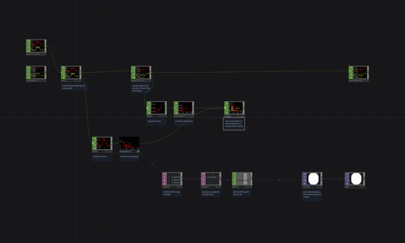

# Audio Reactive Kick Drum Detection

A slightly more complex audio reactive example showing how to use a DAT as a kind of bandpass filter to detect a kick drum (or any loudness spike at around 80Hz).

[Download this example](https://github.com/XRRCA/CreativeCoding/raw/main/touchdesigner/audio-reactive-bass/audio-reactive-bass.toe) | [Download all examples as `.zip`](https://github.com/XRRCA/CreativeCoding/archive/refs/heads/main.zip)
