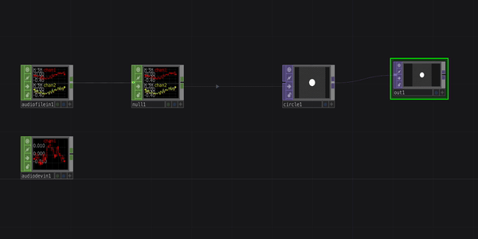

# Simple Audio Reactivity

A basic example of audio reactivity showing a circle whose radius changes in response to the volume of an input audio.

[Download this example](https://github.com/XRRCA/CreativeCoding/raw/main/touchdesigner/audio-reactive-simple/audio-reactive-simple.toe) | [Download all examples as `.zip`](https://github.com/XRRCA/CreativeCoding/archive/refs/heads/main.zip)
