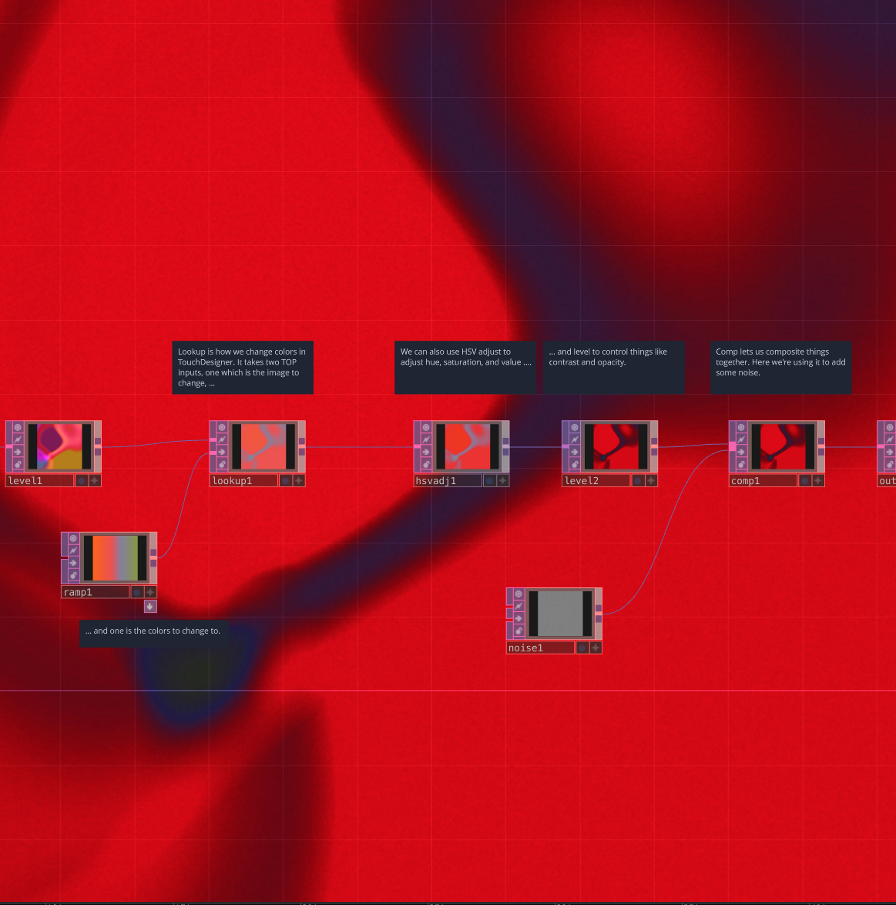

# Color Lookups

Simple example showing how to alter the colors of a TouchDesigner file or it's TOP output.

[Download this example](https://github.com/XRRCA/CreativeCoding/raw/main/touchdesigner/color-lookup/color-lookup.toe) | [Download all examples as `.zip`](https://github.com/XRRCA/CreativeCoding/archive/refs/heads/main.zip)
