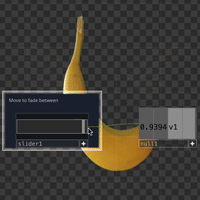

# Simple Fade

Demonstrates fading between two movie files based on a single input using the level TOP.

[Download this example](https://github.com/XRRCA/CreativeCoding/raw/main/touchdesigner/fade-simple/fade-simple.toe) | [Download all examples as `.zip`](https://github.com/XRRCA/CreativeCoding/archive/refs/heads/main.zip)
