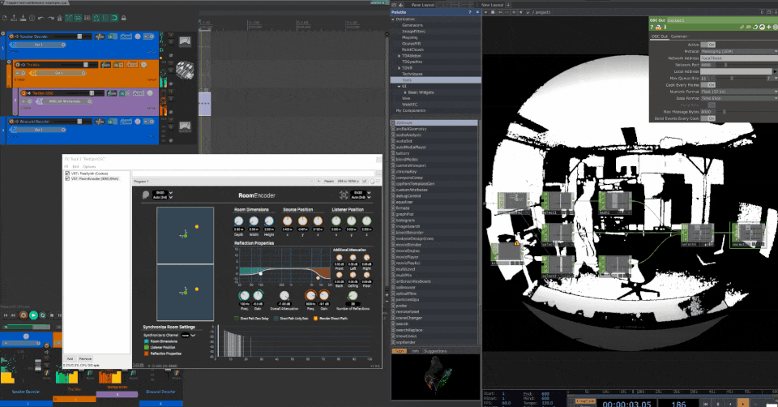

# Kinect Bodytracking OSC Example

Uses the Kinect Azure Depth camera's bodytracking functionality to track positions on the body and send out their cartisian coordinates (X, Y, Z) over Open Sound Control (OSC).
Can also use the Kinect 1/2 using the *Kinect CHOP*.
The example uses ambisonics to position a sound within a 360 soundfield, [click here for more info on *Spatial Audio*](https://github.com/XRRCA/SpatLab/wiki).
It also makes use of the Spatial Audio Lab in RCA White City, but you can use any Speaker Decoder and the Binaural Decoder to monitor the audio.

## Requirements

+ [IEM Plugin Suite](https://plugins.iem.at/)
+ [Reaper](https://www.reaper.fm/)
+ Kinect Camera
+ obv Touchdesigner

[Download this example](https://github.com/trencrumb/CreativeCoding/raw/main/touchdesigner/kinect-bodytracking-osc/kinect-bodytracking-osc.zip) | [Download all examples as `.zip`](https://github.com/XRRCA/CreativeCoding/archive/refs/heads/main.zip)
