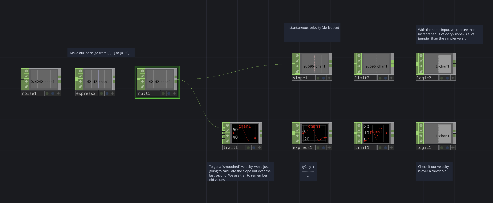

# Velocity calculation

Calculate the velocity of some positional data, for example x/y/z coordinates from a Kinect. This example shows how to calculate 1-dimensional positional velocity.

[Download this example](https://github.com/XRRCA/CreativeCoding/raw/main/touchdesigner/math-velocity/math-velocity.toe) | [Download all examples as `.zip`](https://github.com/XRRCA/CreativeCoding/archive/refs/heads/main.zip)
