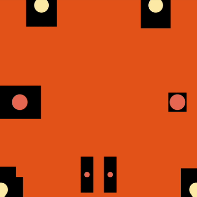

# Simple Noise Example

Simple demonstration of the noise CHOP, used to randomly translate circles and rectangles.

[Download this example](https://github.com/XRRCA/CreativeCoding/raw/main/touchdesigner/noise-simple/noise-simple.toe) | [Download all examples as `.zip`](https://github.com/XRRCA/CreativeCoding/archive/refs/heads/main.zip)

Based on [Sound, Chaos and the Sky](https://www.londondesignfestival.com/activities/sound-chaos-and-the-sky) by Muskeen Liddar
