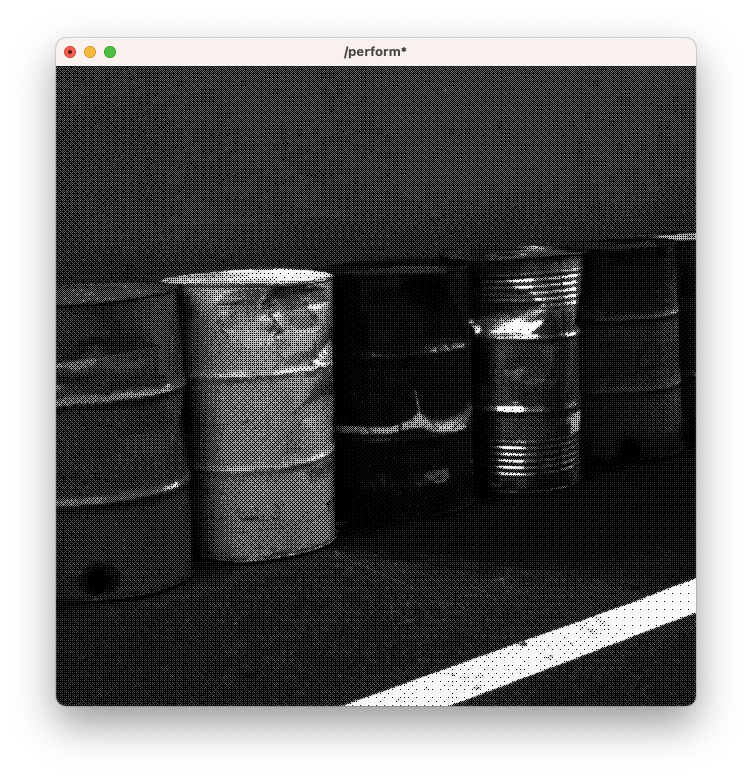

# Import shaders from shadertoy to TouchDesigner

Using [shadertoy2td](https://derivative.ca/community-post/asset/shadertoy2td-convert-shadertoy-url-touchdesigner-network/67490), you can import shaders from [shadertoy](shadertoy.com/) as TouchDesigner networks. This example shows how to do so with a [dithering shader](https://www.shadertoy.com/view/tsKfDW).

Dithering is a technique which was used to convert higher bit depth images to lower bit depth images, i.e. 8 bit (256) color to 1 bit (black and white). It was used for early computer systems to save space. This dither relies on a lookup dither image (rather than hardcoding the constants in code), which comes from [here](https://github.com/tromero/BayerMatrix).

[Download this example](https://github.com/XRRCA/CreativeCoding/raw/main/touchdesigner/shaders-shadertoy-dither/shadertoy-dither.toe) | [Download all examples as `.zip`](https://github.com/XRRCA/CreativeCoding/archive/refs/heads/main.zip)
