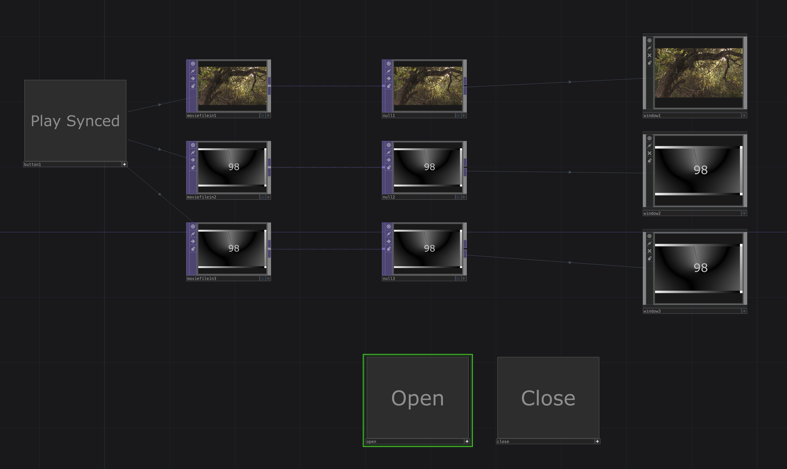

# Video Projection Synced

Play multiple video files synchronized across different monitors. The monitor can be controlled using the monitor parameter on the window COMP.

[Download this example](https://github.com/XRRCA/CreativeCoding/raw/main/touchdesigner/video-projection-synced/video-projection-synced.toe) | [Download all examples as `.zip`](https://github.com/XRRCA/CreativeCoding/archive/refs/heads/main.zip)

For more information, check out [this video](https://www.youtube.com/watch?v=UBmTkOCovus) from elekktronaut
