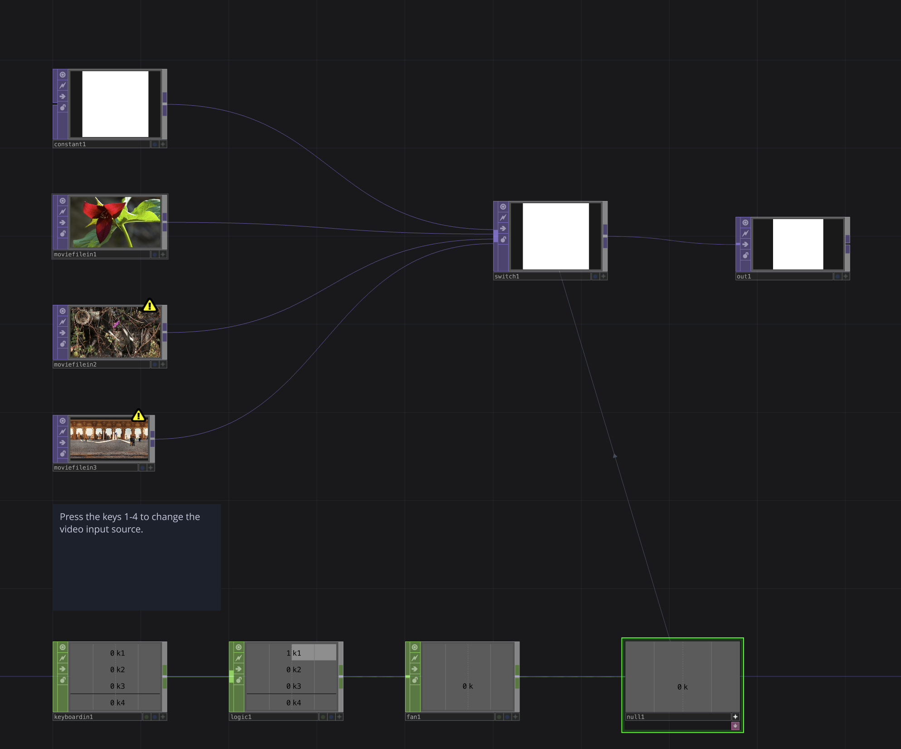

# Video Switcher

`video-switcher.toe` changes the video file playing using the keys `1-4` on your keyboard. It also contains an example of restarting the video file when it's switched to.

[Download this example](https://github.com/XRRCA/CreativeCoding/raw/main/touchdesigner/video-switcher/video-switcher.toe) | [Download all examples as `.zip`](https://github.com/XRRCA/CreativeCoding/archive/refs/heads/main.zip)
