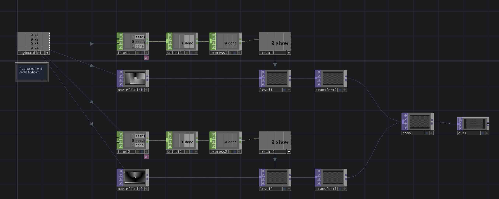

# Video Trigger

Trigger video files to play like one-shot audio samples: pressing a key will play the video file for a specified amount of time. You can modify this file with an info CHOP and use the length channel to time the timer to play the videos exactly once, if you like.

[Download this example](https://github.com/XRRCA/CreativeCoding/raw/main/touchdesigner/video-trigger/video-trigger.toe) | [Download all examples as `.zip`](https://github.com/XRRCA/CreativeCoding/archive/refs/heads/main.zip)
